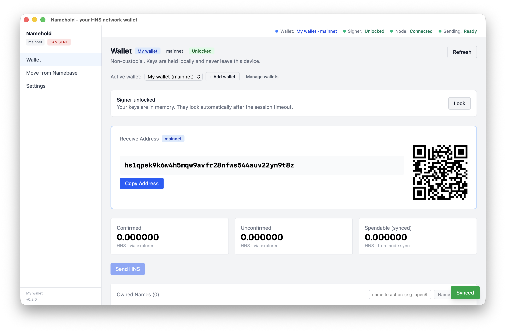
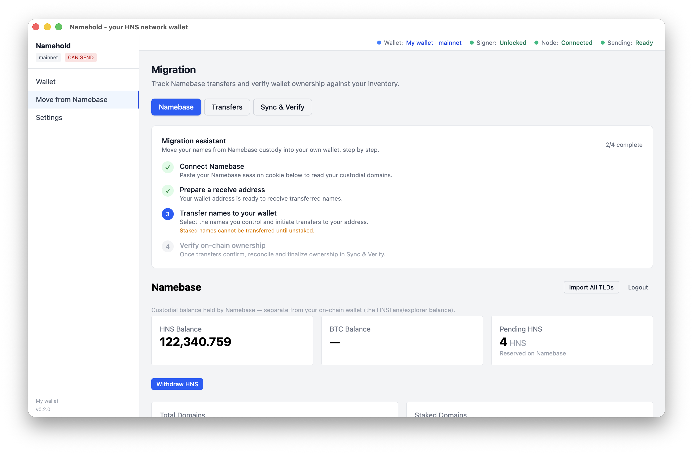

# Namehold — a non-custodial Handshake (HNS) wallet

Namehold is a local desktop wallet for **Handshake (HNS)**: hold HNS, manage the
names you own, run the full name-auction lifecycle, and edit on-chain DNS — all
non-custodially, with your keys encrypted on your own machine. It also includes a
guided **Move from Namebase** helper for migrating names and funds off the
custodial service.

Built with Tauri v2, React + TypeScript, Rust, and SQLite.

<p align="center">
  
</p>

> ⚠️ **Beta software.** Namehold is under active development and can make mistakes.
> Transactions and Namebase transfers are **irreversible** — always test with a
> single name or a small amount and confirm it arrives **before** sending or
> transferring everything.

## Features

### Wallet (the core)
- **Create or import** a wallet from a BIP39 mnemonic, or add a **watch-only**
  wallet from an account xpub.
- **Multiple wallets** — switch between them and delete ones you no longer need.
- **Receive** — your address with a QR code, one-click copy.
- **Per-wallet balances** — each wallet shows its own balance; values persist and
  refresh on demand (no bleed between wallets).

### Send HNS
- A **build → sign → broadcast** draft flow: preview fee/change before any key is
  touched, sign in the secure window, then broadcast.
- **Send Max** to sweep a wallet.
- **Status tracking** — sent transactions move Pending → Confirmed (with block
  height), or are flagged "Not confirmed" if they never make it on-chain.

### Names & auctions
- The complete Vickrey-auction lifecycle: **open, bid, reveal, redeem, register,
  update, transfer, finalize, cancel, renew, revoke**.
- **Phase badges + countdowns** for each owned name, a **reveal-required alert**,
  and a **"Locked in Auctions"** balance for in-flight bids.
- A typed **DNS-record editor** (TXT/A/AAAA/NS/CNAME…) for register/update, with a
  raw-JSON fallback.

### Node-free reads
- Balances and owned names are read from the **HNSFans explorer** — no node
  required just to view your wallet. A local node is needed **only to send or
  perform name actions**.

### Move from Namebase (one feature, not the core)
- Connect with your Namebase session cookie to **list custodial domains**, see
  which are **expiring soon**, **transfer names out** to your wallet, **withdraw
  HNS**, and **compare** your inventory against what Namebase still holds.

### Portfolio (optional — enable "Advanced mode" in Settings)
- A migration-inventory workspace: **CSV import/export**, tags/filters, **batches**,
  **renewals** tracking, and per-name **migration-status** tracking.

## How it works

- **Reads are node-free.** Balances and names come from the explorer and are cached
  locally per wallet.
- **Sending needs a node.** Broadcasting and coin/owner discovery use a local
  **hsd** node over RPC. The app can start/stop hsd for you (Settings → Connections).
- **Secrets stay in a secure window.** Your mnemonic/passphrase is only ever typed
  into — and your backup phrase only ever shown in — a small **Rust-owned window**;
  it never passes through the web UI. At rest it's an **encrypted vault**
  (Argon2id + AES-256-GCM) inside the local database.
- **Write-capability gating.** Spend/name actions are enabled only when the signer
  is unlocked **and** the node is reachable, synced, and address-indexed — with a
  precise reason shown when any condition isn't met.

## Security

- **Non-custodial** — your keys live on your device, encrypted; nothing is custodied.
- **Secrets never reach the web layer** — entry/display happen in the secure window,
  and signing happens in Rust.
- **Local-only** — all data stays on your machine. No cloud, no telemetry.
- **Auto-lock** — the unlocked signer times out after a configurable idle period.

## Prerequisites

- [Node.js](https://nodejs.org/) 22+
- [pnpm](https://pnpm.io/) 11+
- [Rust](https://www.rust-lang.org/tools/install) (stable, edition 2021)
- [hsd](https://github.com/handshake-org/hsd) — **only needed for sending / name
  actions** (reads work without it). Run it with `--index-address`.

## Quick start

```bash
git clone <repo-url>
cd namehold-wallet
pnpm install
pnpm tauri dev
```

## Running a node (only to send)

Reads need no node. To send HNS or perform name actions, run an **address-indexed**
hsd node:

```bash
hsd --index-address --index-tx --api-key=<your-key>
# mainnet node RPC: http://127.0.0.1:12037
```

- `--index-address` is **required** (the wallet finds your coins by address);
  `--index-tx` backs transaction history + confirmation tracking.
- The app can manage hsd for you — set the **data directory** and (if needed) the
  **hsd binary path** in **Settings → Connections**, then click **Start hsd**.
- **hsd can't add an index to an already-synced chain.** If your existing chain
  was synced without these indexes, the app detects it and offers a **one-click
  re-sync** (it moves the old chain to a backup and re-syncs with the right indexes).

| Network | Node RPC port |
|---------|---------------|
| Mainnet | 12037         |
| Testnet | 13037         |
| Regtest | 14037         |

See [`docs/NODE_SETUP.md`](docs/NODE_SETUP.md) and
[`docs/REGTEST_TESTING.md`](docs/REGTEST_TESTING.md) for details.

## Move from Namebase

A guided migration helper (not the wallet's core function). In **Move from
Namebase**, paste your Namebase session cookie to connect, then:

<p align="center">
  
</p>

- review your custodial domains and which are **expiring soon**,
- **transfer** names out to your own wallet address,
- **withdraw HNS** to an address,
- **compare** your imported inventory against Namebase's current list.

On-chain finalization of transfers uses the same node-backed write path as the
rest of the wallet.

## Advanced: Portfolio inventory

Enable **Advanced mode** in Settings to show the **Portfolio** workspace for
tracking a larger migration.

**CSV import** columns:

```csv
Name,Staked,Category,Tags,Notes
crypto,true,Premium,"high_value,operational",High-value TLD
wallet,false,Finance,"medium_value",Finance TLD
```

- **Name** (required; leading dots stripped) · **Staked** (`true`/`1`/`yes` ⇒ staked)
  · **Category** · **Tags** (comma-separated) · **Notes**.
- Staked names are set to `do_not_touch_staked` so they're never migrated.

Per-name **migration status**: `not_started` → `namebase_transfer_requested` →
`waiting_transfer_tx` → `transfer_seen_on_chain` → `waiting_finalize` →
`finalized_owned`, plus `failed_or_stuck` and `do_not_touch_staked`.

## Build for production

```bash
pnpm tauri build
```

Output in `src-tauri/target/release/bundle/` — macOS `.app`/`.dmg`, Windows `.msi`,
Linux `.AppImage`/`.deb`. CI (PR tests) and the cross-platform release pipeline live
in [`.github/workflows`](.github/workflows).

## Data location

All app data lives in one SQLite file in your home folder (pairs with hsd's `~/.hsd`),
on every platform:

- `~/.namehold/portfolio.db`

It holds your wallet profiles, the encrypted vault, the local chain cache, and (if
used) the Portfolio inventory/batches/audit log.

## Tech stack

- **Tauri v2** — desktop shell
- **React 19 + TypeScript** — frontend
- **Vite** — build tool
- **TanStack Query** — async state (TanStack Table + Virtual for the Portfolio grid)
- **Zustand** — client state
- **Zod** — validation
- **SQLite (rusqlite)** — local database
- **reqwest** — HTTP client (explorer + hsd RPC)
- **secp256k1 · bip39 · argon2 · aes-gcm · zeroize** — keys, mnemonics, vault crypto
- **Tailwind CSS** — styling
